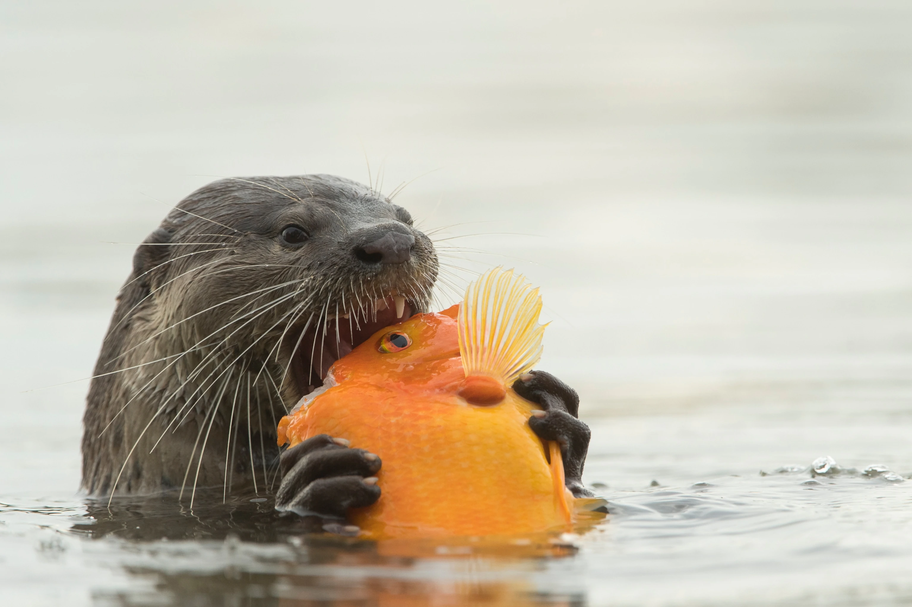

# Otter Sightings Website
## A project about otters in Singapore
### By Paul Chor

Purpose of my website:
* Showcase cute otters
* Inform the public about how to treat wild animals
* Show the public where to observe otters

Target audience:
1. Otter lovers
2. Nature lovers
3. Hikers

We use the `<div class="container">` to create a Bootstrap container

Here is how we can include a responisve image in Bootstrap

```

```

